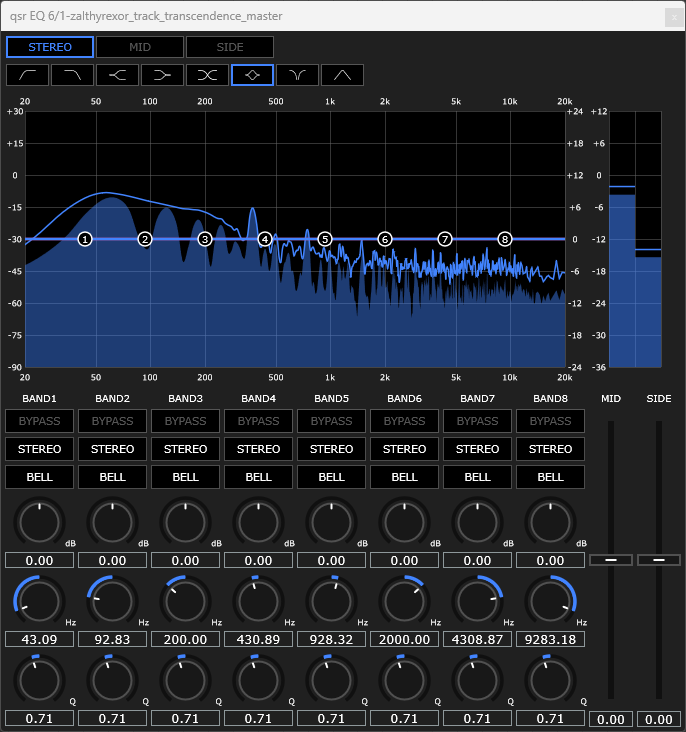

# Quasar EQ by Zalthyrexor
**Zero noise, zero latency.**  
**One click to create a filter.**

## Specifications
8 Band Parametric EQ  
8 Filter Types (High/Low/Band Pass, High/Low Shelf, Notch, Bell, Tilt)  
Mid/Side/Stereo selection per band

## Format
VST3 (64-bit)

## System Requirements
Windows 10 / 11 (64-bit)  
AVX2 Supported CPU

## Links
Source Code  
https://github.com/zalthyrexor/QuasarEQ  
Distribution  
https://zalthyrexor.itch.io/quasar-eq

## Acknowledgements
Andrew Simper (Cytomic)  
JUCE Framework
