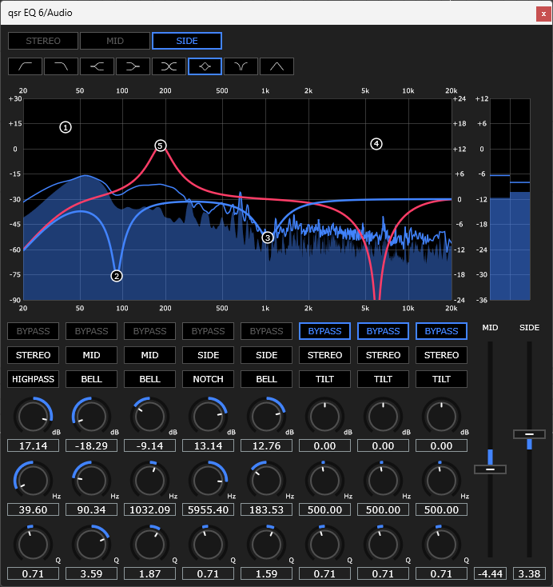

# Quasar EQ
**Developed by Zalthyrexor**

### Features
- **Filter Types**: HighPass, HighShelf, LowPass, LowShelf, Bell, Tilt, Notch, BandPass
- **Processing**: Per-band Stereo / Mid / Side selection
- **Tested on**: Ableton Live, Cubase, Cakewalk

### Tech Stack
- **Language**: C++20
- **Framework**: JUCE 8
- **IDE**: Visual Studio 2022

### Acknowledgements
- **Andrew Simper (Cytomic)**: For his research on SVF and TPT filter structures.
- **JUCE Framework**: For providing the foundation for audio plugin development.
